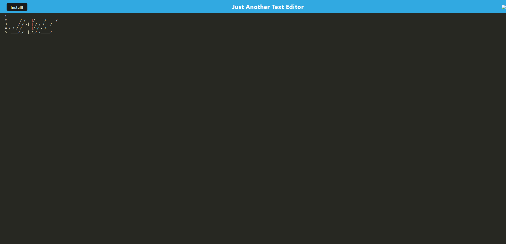

# Text Editor PWA 

## Description:
Free and fun cool text editer, still in testing but will soon be updated. 

## Install/Testing:
1. Run "npm i" to install packages on your terminal.
2. Run "npm run build" to compile files.
3. Run "npm run start" to start the server on your browser's http://localhost:3000/. 
4. Deployed heroku link below.
 

## Usage:

## Links:
[Github Repo](https://github.com/jon-dev092/text-editor-pwa)                                                                                                                                                
[Heroku Page](https://quiet-brushlands-21113.herokuapp.com/)

